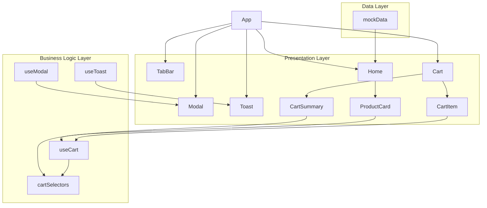

# 테스트용 단일 탭형 장바구니 UI 설계

## 개요

### 모듈 목록

| 모듈명 | 위치 | 설명 |
|--------|------|------|
| **App** | `src/App.tsx` | 메인 애플리케이션 컴포넌트, 탭 상태 관리 |
| **TabBar** | `src/components/presentation/TabBar.tsx` | 하단 고정 탭 네비게이션 |
| **Home** | `src/components/presentation/Home.tsx` | 홈 화면, 상품 목록 표시 |
| **ProductCard** | `src/components/presentation/ProductCard.tsx` | 개별 상품 카드 컴포넌트 |
| **Cart** | `src/components/presentation/Cart.tsx` | 장바구니 화면 |
| **CartItem** | `src/components/presentation/CartItem.tsx` | 장바구니 개별 아이템 |
| **CartSummary** | `src/components/presentation/CartSummary.tsx` | 장바구니 요약 영역 |
| **Modal** | `src/components/presentation/Modal.tsx` | 공통 모달 컴포넌트 |
| **Toast** | `src/components/presentation/Toast.tsx` | 토스트 알림 컴포넌트 |
| **useCart** | `src/hooks/business/useCart.ts` | 장바구니 상태 및 비즈니스 로직 |
| **useToast** | `src/hooks/business/useToast.ts` | 토스트 상태 관리 |
| **useModal** | `src/hooks/business/useModal.ts` | 모달 상태 관리 |
| **cartSelectors** | `src/selectors/cartSelectors.ts` | 장바구니 계산 로직 (배송비, 적립금 등) |
| **mockData** | `src/data/mockData.ts` | 더미 상품 데이터 |

## Diagram



## Implementation Plan

### 1. Presentation Layer

#### 1.1 App Component (`src/App.tsx`)
- **역할**: 메인 애플리케이션, 탭 상태 관리
- **구현 계획**:
  - useState로 현재 활성 탭 관리
  - 탭별 컴포넌트 렌더링
  - 전역 상태 프로바이더 설정

#### 1.2 TabBar Component (`src/components/presentation/TabBar.tsx`)
- **역할**: 하단 고정 탭 네비게이션
- **구현 계획**:
  - 4개 탭 (홈, 장바구니, 커뮤니티, 마이페이지)
  - 활성 탭 하이라이트
  - Tailwind 스타일링

#### 1.3 Home Component (`src/components/presentation/Home.tsx`)
- **역할**: 홈 화면, 상품 목록 표시
- **구현 계획**:
  - 2열 그리드 레이아웃
  - ProductCard 컴포넌트 렌더링
  - 더미 데이터 연동

#### 1.4 ProductCard Component (`src/components/presentation/ProductCard.tsx`)
- **역할**: 개별 상품 카드
- **구현 계획**:
  - 상품 정보 표시 (이미지, 이름, 가격, 평점, 리뷰수)
  - "장바구니 담기" 버튼
  - useCart 훅 연동

#### 1.5 Cart Component (`src/components/presentation/Cart.tsx`)
- **역할**: 장바구니 화면
- **구현 계획**:
  - 빈 장바구니 상태 처리
  - CartItem 리스트 렌더링
  - CartSummary 렌더링
  - 선택 삭제 기능

#### 1.6 CartItem Component (`src/components/presentation/CartItem.tsx`)
- **역할**: 장바구니 개별 아이템
- **구현 계획**:
  - 썸네일, 이름, 단가, 수량 조절, 소계, 체크박스, 삭제 버튼
  - 수량 증가/감소 버튼 (aria-label 포함)
  - 개별 삭제 기능

#### 1.7 CartSummary Component (`src/components/presentation/CartSummary.tsx`)
- **역할**: 장바구니 요약 영역
- **구현 계획**:
  - 선택한 상품 총액
  - 배송비 (무료배송 안내 포함)
  - 총 결제 금액
  - 예상 적립금
  - 구매하기 버튼

#### 1.8 Modal Component (`src/components/presentation/Modal.tsx`)
- **역할**: 공통 모달 컴포넌트
- **구현 계획**:
  - 배경 클릭으로 닫기
  - 닫기 버튼
  - 재사용 가능한 구조

#### 1.9 Toast Component (`src/components/presentation/Toast.tsx`)
- **역할**: 토스트 알림
- **구현 계획**:
  - 우상단 위치
  - 2초 후 자동 사라짐
  - 중복 클릭시 새 토스트 추가

### 2. Business Logic Layer

#### 2.1 useCart Hook (`src/hooks/business/useCart.ts`)
- **역할**: 장바구니 상태 및 비즈니스 로직
- **구현 계획**:
  - cartItems 상태 관리
  - 상품 추가/수량 변경/삭제 로직
  - 선택 상태 토글
  - 선택 삭제 기능

#### 2.2 useToast Hook (`src/hooks/business/useToast.ts`)
- **역할**: 토스트 상태 관리
- **구현 계획**:
  - toast 리스트 상태 관리
  - 토스트 추가/제거 로직
  - 자동 제거 타이머

#### 2.3 useModal Hook (`src/hooks/business/useModal.ts`)
- **역할**: 모달 상태 관리
- **구현 계획**:
  - 모달 열림/닫힘 상태
  - 모달 타입별 처리

#### 2.4 cartSelectors (`src/selectors/cartSelectors.ts`)
- **역할**: 장바구니 계산 로직
- **구현 계획**:
  - 선택한 상품 총액 계산
  - 배송비 계산 (무료배송 기준)
  - 총 결제 금액 계산
  - 예상 적립금 계산 (5%, 원단위 내림)

### 3. Data Layer

#### 3.1 mockData (`src/data/mockData.ts`)
- **역할**: 더미 상품 데이터
- **구현 계획**:
  - 5개 상품 데이터 (id, name, price, rating, reviewCount, imageUrl)
  - placeholder 이미지 URL

### 4. QA Sheet (Presentation Layer)

#### 4.1 TabBar QA
- [ ] 4개 탭이 올바르게 표시되는가?
- [ ] 활성 탭이 하이라이트되는가?
- [ ] 탭 클릭시 올바른 화면으로 전환되는가?
- [ ] 커뮤니티/마이페이지 탭 클릭시 "준비중입니다" 모달이 표시되는가?

#### 4.2 Home QA
- [ ] 2열 그리드로 상품이 표시되는가?
- [ ] 5개 상품이 모두 표시되는가?
- [ ] 상품 정보가 올바르게 표시되는가?

#### 4.3 ProductCard QA
- [ ] 상품 이미지, 이름, 가격, 평점, 리뷰수가 표시되는가?
- [ ] "장바구니 담기" 버튼이 작동하는가?
- [ ] 버튼 클릭시 토스트가 표시되는가?

#### 4.4 Cart QA
- [ ] 빈 장바구니일 때 "장바구니가 비어있습니다" 메시지가 표시되는가?
- [ ] 상품이 있을 때 리스트가 표시되는가?
- [ ] "선택 삭제" 버튼이 체크된 항목만 삭제하는가?

#### 4.5 CartItem QA
- [ ] 모든 필드가 올바르게 표시되는가?
- [ ] 수량 증가/감소 버튼이 작동하는가?
- [ ] 수량이 1일 때 감소 버튼이 비활성화되는가?
- [ ] 체크박스가 올바르게 작동하는가?
- [ ] 개별 삭제 버튼이 작동하는가?

#### 4.6 CartSummary QA
- [ ] 선택한 상품 총액이 올바르게 계산되는가?
- [ ] 배송비가 올바르게 표시되는가?
- [ ] 무료배송 안내가 조건에 따라 표시되는가?
- [ ] 총 결제 금액이 올바르게 계산되는가?
- [ ] 예상 적립금이 올바르게 계산되는가?
- [ ] 구매하기 버튼이 조건에 따라 활성화되는가?

#### 4.7 Modal QA
- [ ] 모달이 올바르게 표시되는가?
- [ ] 배경 클릭시 모달이 닫히는가?
- [ ] 닫기 버튼으로 모달이 닫히는가?

#### 4.8 Toast QA
- [ ] 토스트가 우상단에 표시되는가?
- [ ] 2초 후 자동으로 사라지는가?
- [ ] 중복 클릭시 새 토스트가 추가되는가?

### 5. Unit Tests (Business Logic Layer)

#### 5.1 useCart Hook Tests
```typescript
describe('useCart', () => {
  test('상품 추가 - 새 상품', () => {
    // 새 상품 추가시 qty=1로 설정되는지 확인
  });
  
  test('상품 추가 - 기존 상품', () => {
    // 기존 상품 추가시 qty가 증가하는지 확인
  });
  
  test('수량 변경', () => {
    // 수량 증가/감소가 올바르게 작동하는지 확인
  });
  
  test('수량 최소값 제한', () => {
    // qty=1일 때 감소가 안되는지 확인
  });
  
  test('상품 삭제', () => {
    // 개별 상품 삭제가 작동하는지 확인
  });
  
  test('선택 삭제', () => {
    // 선택된 상품만 삭제되는지 확인
  });
  
  test('선택 상태 토글', () => {
    // 체크박스 토글이 올바르게 작동하는지 확인
  });
});
```

#### 5.2 cartSelectors Tests
```typescript
describe('cartSelectors', () => {
  test('선택한 상품 총액 계산', () => {
    // 체크된 항목의 price * qty 합계가 올바른지 확인
  });
  
  test('배송비 계산 - 무료배송 미만', () => {
    // 30,000원 미만일 때 3,000원 배송비 확인
  });
  
  test('배송비 계산 - 무료배송 기준', () => {
    // 30,000원 이상일 때 배송비 0원 확인
  });
  
  test('배송비 계산 - 선택 항목 없음', () => {
    // 선택 항목이 없을 때 배송비 0원 확인
  });
  
  test('총 결제 금액 계산', () => {
    // 선택한 상품 총액 + 배송비가 올바른지 확인
  });
  
  test('예상 적립금 계산', () => {
    // 선택한 상품 총액 * 0.05, 원단위 내림이 올바른지 확인
  });
});
```

#### 5.3 useToast Hook Tests
```typescript
describe('useToast', () => {
  test('토스트 추가', () => {
    // 토스트가 리스트에 추가되는지 확인
  });
  
  test('토스트 자동 제거', () => {
    // 2초 후 토스트가 자동으로 제거되는지 확인
  });
  
  test('중복 토스트 추가', () => {
    // 중복 클릭시 새 토스트가 추가되는지 확인
  });
});
```

#### 5.4 useModal Hook Tests
```typescript
describe('useModal', () => {
  test('모달 열기', () => {
    // 모달이 열리는지 확인
  });
  
  test('모달 닫기', () => {
    // 모달이 닫히는지 확인
  });
  
  test('모달 타입별 처리', () => {
    // 준비중/결제 모달이 올바르게 처리되는지 확인
  });
});
```

### 6. 특별 고려사항

#### 6.1 통화 표시
- 모든 금액은 "₩" + 천단위 구분 (예: ₩12,300)
- 소수점 없음
- 원단위 내림 처리

#### 6.2 접근성
- 버튼에 aria-label 부여
- 수량 증가/감소/삭제 버튼에 적절한 라벨

#### 6.3 상태 관리
- 새로고침시 상태 유지하지 않음
- 모든 계산은 동기적으로 수행
- 메모이제이션 불필요

#### 6.4 스타일링
- Tailwind CSS만 사용
- 2열 그리드 레이아웃 (모바일 가정)
- 최소한의 카드 스타일
- 아이콘은 텍스트 기호로 대체 (+, -)

## 요구사항 분석

### User Flow
1. **홈 화면 진입** → 상품 목록 확인
2. **상품 선택** → "장바구니 담기" 클릭 → 토스트 알림
3. **장바구니 탭 이동** → 담은 상품 확인
4. **수량 조절** → +/- 버튼으로 수량 변경
5. **상품 선택** → 체크박스로 구매할 상품 선택
6. **구매 진행** → "구매하기" 버튼 클릭 → 결제 모달
7. **기타 탭** → 커뮤니티/마이페이지 클릭 → 준비중 모달

### Data Flow
1. **상품 데이터** → mockData → Home → ProductCard
2. **장바구니 상태** → useCart → Cart → CartItem
3. **계산 로직** → cartSelectors → CartSummary
4. **UI 상태** → useToast/useModal → Toast/Modal

### 비즈니스 규칙
- **배송비**: 기본 3,000원, 30,000원 이상 구매시 무료
- **적립금**: 구매 금액의 5% (원단위 내림)
- **수량 제한**: 최소 1개
- **상태 유지**: 새로고침시 초기화
